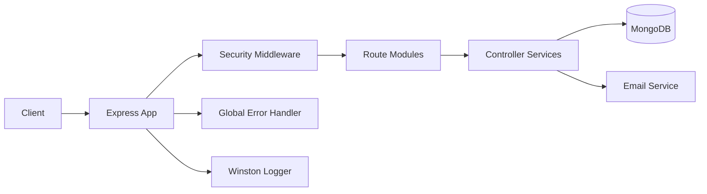
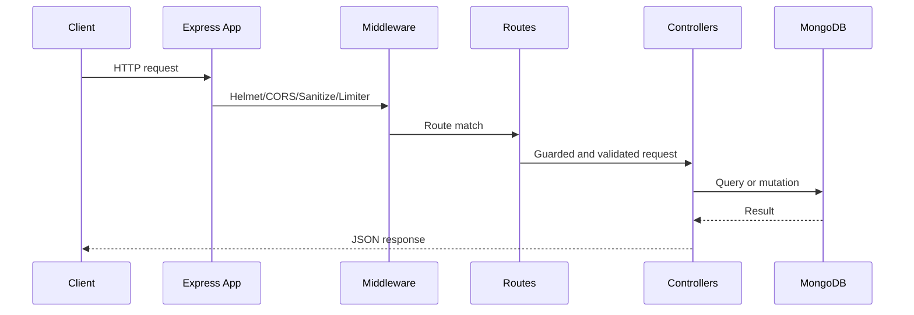

# Pro-Talent-Connect Backend API

<div align="center">


High-trust API for player data, admin control workflows, and public content delivery.

</div>

## Table of Contents

1. [Executive Summary](#executive-summary)
2. [Architecture](#architecture)
3. [Project Layout](#project-layout)
4. [Runtime and Environment](#runtime-and-environment)
5. [Security Controls](#security-controls)
6. [Authentication and Authorization](#authentication-and-authorization)
7. [Rate Limiting and Cache Policy](#rate-limiting-and-cache-policy)
8. [API Versioning and Base URLs](#api-versioning-and-base-urls)
9. [Module Access Matrix](#module-access-matrix)
10. [Endpoint Catalog](#endpoint-catalog)
11. [API Example Usage](#api-example-usage)
12. [Error Behavior and Response Contract](#error-behavior-and-response-contract)
13. [Data Model Overview](#data-model-overview)
14. [Validation Coverage](#validation-coverage)
15. [Testing and Quality](#testing-and-quality)
16. [Operational Runbook](#operational-runbook)
17. [Production Checklist](#production-checklist)
18. [Route and Sub-Route Screenshots](#route-and-sub-route-screenshots)
19. [Troubleshooting](#troubleshooting)

## Executive Summary

This service powers both public and admin experiences. It is designed with role boundaries, defensive middleware, and operational observability.

Business responsibilities:

- Public data retrieval for players, blogs, services, and about content.
- Admin operations for data management and content lifecycle.
- Auditable privileged changes and security-first request handling.

## Architecture



### Request Processing Sequence



## Project Layout

```text
ProTalentConnect_Backend/
|- app.js
|- server.js
|- package.json
|- jest.config.js
|- config/
|  |- DB.js
|  |- logger.js
|  |- validateEnv.js
|- Middleware/
|  |- authMiddleware.js
|  |- cache.js
|  |- errorHandler.js
|  |- mongoSanitize.js
|  |- rateLimiter.js
|  |- validator.js
|- Models/
|  |- About.js
|  |- Admin.js
|  |- AuditLog.js
|  |- Blog.js
|  |- Enquiry.js
|  |- HowItWork.js
|  |- League.js
|  |- Otp.js
|  |- Players.js
|  |- ProfileRequest.js
|  |- Service.js
|- Routes/
|  |- aboutRoutes.js
|  |- adminRoutes.js
|  |- auditLogRoutes.js
|  |- authRoutes.js
|  |- blogRoutes.js
|  |- contactRoutes.js
|  |- dashboardRoutes.js
|  |- leagueRoutes.js
|  |- otpRoutes.js
|  |- playerRoutes.js
|  |- serviceRoutes.js
|- services/
|  |- aboutController.js
|  |- adminController.js
|  |- auditLogController.js
|  |- authController.js
|  |- blogController.js
|  |- contactController.js
|  |- dashboardController.js
|  |- emailService.js
|  |- generateToken.js
|  |- keepAliveWorker.js
|  |- leagueController.js
|  |- otpController.js
|  |- playerController.js
|  |- scoutReportCalculator.js
|  |- serviceController.js
|- tests/
|  |- auth.test.js
|  |- dashboard.test.js
|  |- players.test.js
|  |- setup.js
|- import-players-csv.js
|- migrate-data.js
|- generate-report.js
|- README.md
```

## Runtime and Environment

Required environment variables (from .env.example baseline):

```env
PORT=5001
NODE_ENV=development
MONGO_URI=mongodb://localhost:27017/pro-talent-connect
JWT_SECRET=<strong-secret>
JWT_EXPIRE=1d
ALLOWED_ORIGINS=http://localhost:3000,http://localhost:5173
SUPER_ADMIN_EMAIL=<local-admin-email>
SUPER_ADMIN_PASSWORD=<local-admin-password>
```

Configuration notes:

- The service defaults to port 5001 when PORT is absent.
- ALLOWED_ORIGINS is comma-separated.
- Production mode denies requests missing Origin.

## Security Controls

Implemented controls:

- Helmet with CSP and HSTS behavior.
- CORS allowlist enforcement.
- NoSQL sanitization middleware.
- API-wide and route-specific rate limits.
- Joi schema validation with unknown-key stripping.
- Centralized error shaping for secure responses.
- Request logging through Winston.

## Authentication and Authorization

### Authentication

- Login issues JWT.
- Protected routes require `Authorization: Bearer <token>`.
- protect middleware resolves current admin on request.

### Authorization

- authorize middleware enforces role list per endpoint.
- Roles:
  - Admin
  - Super Admin

## Rate Limiting and Cache Policy

### Rate Limiting

| Limiter | Window | Max | Usage |
|---|---:|---:|---|
| apiLimiter | 15 min | 1000/IP | All /api routes |
| authLimiter | 15 min | 5/IP | Login endpoint |
| createLimiter | 60 min | 200/IP | Create-heavy and OTP send routes |

### Caching

| Module | Typical TTL |
|---|---:|
| Players list/search | 30s |
| Player detail | 60s |
| Blogs list/detail | 60s to 120s |
| About/services/how-it-works | 300s |
| Leagues list | 120s |

Write routes invalidate relevant cache prefixes.

## API Versioning and Base URLs

Both route families are active:

- Preferred: `/api/v1/...`
- Compatibility: `/api/...`

Core probes:

- `GET /`
- `GET /health`
- `GET /ping`

## Module Access Matrix

| Module | Public | Admin | Super Admin |
|---|---|---|---|
| Auth | Login only | Yes | Yes |
| Admins | No | No | Yes |
| Players | Read only | Create/Update | Full |
| Dashboard | No | Yes | Yes |
| Blogs | Published read only | Create/Update/Publish | Full |
| About | Read only | No | Update |
| Services + How-It-Works | Read only | Write | Write |
| Contact | Submit only | Review/Update | Review/Update |
| OTP | No | Yes | Yes |
| Leagues | Read only | Write | Write |
| Audit Logs | No | No | Yes |

## Endpoint Catalog

### Auth

| Method | Endpoint | Access | Validation |
|---|---|---|---|
| POST | /auth/login | Public | loginSchema |
| POST | /auth/logout | Authenticated | N/A |
| POST | /auth/refresh | Authenticated | N/A |
| POST | /auth/register | Super Admin | registerAdminSchema |
| GET | /auth/profile | Authenticated | N/A |
| PUT | /auth/change-password | Authenticated | N/A |
| PUT | /auth/admin/:id/role | Super Admin | Controller checks |

### Admins

| Method | Endpoint | Access |
|---|---|---|
| GET | /admins | Super Admin |
| POST | /admins | Super Admin |
| GET | /admins/:id | Super Admin |
| PUT | /admins/:id | Super Admin |
| PATCH | /admins/:id/demote | Super Admin |
| DELETE | /admins/:id | Super Admin |

### Players

| Method | Endpoint | Access | Validation |
|---|---|---|---|
| GET | /players | Public | N/A |
| GET | /players/search | Public | Query/controller checks |
| GET | /players/:id | Public | ObjectId/controller checks |
| POST | /players | Admin, Super Admin | createPlayerSchema |
| PUT | /players/:id | Admin, Super Admin | updatePlayerSchema |
| DELETE | /players/:id | Super Admin | Controller checks |

### Dashboard

| Method | Endpoint | Access |
|---|---|---|
| GET | /dashboard/stats | Admin, Super Admin |

### Blogs

| Method | Endpoint | Access |
|---|---|---|
| GET | /blogs | Public |
| GET | /blogs/:identifier | Public |
| GET | /blogs/all | Admin, Super Admin |
| POST | /blogs | Admin, Super Admin |
| PUT | /blogs/:id | Admin, Super Admin |
| PATCH | /blogs/:id/publish | Admin, Super Admin |
| DELETE | /blogs/:id | Super Admin |

### About

| Method | Endpoint | Access |
|---|---|---|
| GET | /about | Public |
| PUT | /about | Super Admin |
| POST | /about/images | Super Admin |

### Services and How-It-Works

| Method | Endpoint | Access |
|---|---|---|
| GET | /services | Public |
| GET | /services/:id | Public |
| POST | /services | Authenticated |
| PUT | /services/:id | Authenticated |
| DELETE | /services/:id | Authenticated |
| GET | /how-it-works | Public |
| GET | /how-it-works/:id | Public |
| POST | /how-it-works | Authenticated |
| PUT | /how-it-works/:id | Authenticated |
| DELETE | /how-it-works/:id | Authenticated |

### Contact

| Method | Endpoint | Access |
|---|---|---|
| POST | /contact/enquiry | Public |
| POST | /contact/profile-request | Public |
| GET | /contact/enquiries | Authenticated |
| GET | /contact/profile-requests | Authenticated |
| PUT | /contact/enquiries/:id | Authenticated |
| PUT | /contact/profile-requests/:id | Authenticated |

### OTP

| Method | Endpoint | Access |
|---|---|---|
| POST | /otp/send-player-otp | Admin, Super Admin |
| POST | /otp/verify-player-otp | Admin, Super Admin |
| POST | /otp/send-password-otp | Authenticated |
| POST | /otp/verify-password-otp | Authenticated |

### Leagues

| Method | Endpoint | Access |
|---|---|---|
| GET | /leagues | Public |
| POST | /leagues | Admin, Super Admin |
| PUT | /leagues/:id | Admin, Super Admin |
| DELETE | /leagues/:id | Admin, Super Admin |

### Audit Logs

| Method | Endpoint | Access |
|---|---|---|
| GET | /audit-logs | Super Admin |

## API Example Usage

All examples use versioned URLs.

### 1) Login

```bash
curl -X POST http://localhost:5001/api/v1/auth/login \
  -H "Content-Type: application/json" \
  -d '{"email":"admin@example.com","password":"Admin@123"}'
```

### 2) Public players list

```bash
curl http://localhost:5001/api/v1/players
```

### 3) Create player

```bash
curl -X POST http://localhost:5001/api/v1/players \
  -H "Authorization: Bearer <TOKEN>" \
  -H "Content-Type: application/json" \
  -d '{
    "name":"Sample Player",
    "age_group":"U19",
    "playingPosition":"Midfielder",
    "preferredFoot":"Right",
    "playerId":"PTC-001",
    "dateOfBirth":"2007-09-15",
    "nationality":"Indian",
    "gender":"Male",
    "mobileNumber":"9876543210",
    "email":"sample.player@example.com"
  }'
```

### 4) Update player

```bash
curl -X PUT http://localhost:5001/api/v1/players/<PLAYER_ID> \
  -H "Authorization: Bearer <TOKEN>" \
  -H "Content-Type: application/json" \
  -d '{"preferredFoot":"Both","state":"Karnataka"}'
```

### 5) Dashboard stats

```bash
curl http://localhost:5001/api/v1/dashboard/stats \
  -H "Authorization: Bearer <TOKEN>"
```

### 6) Submit enquiry

```bash
curl -X POST http://localhost:5001/api/v1/contact/enquiry \
  -H "Content-Type: application/json" \
  -d '{
    "name":"John Doe",
    "email":"john@example.com",
    "subject":"Trial Request",
    "message":"Please share upcoming trial details."
  }'
```

### 7) Create blog

```bash
curl -X POST http://localhost:5001/api/v1/blogs \
  -H "Authorization: Bearer <TOKEN>" \
  -H "Content-Type: application/json" \
  -d '{
    "title":"Academy Prospect Update",
    "slug":"academy-prospect-update",
    "excerpt":"Short excerpt for the blog post.",
    "content":"Detailed blog content goes here.",
    "author":"Editorial Team",
    "category":"Scouting"
  }'
```

### 8) Send password OTP

```bash
curl -X POST http://localhost:5001/api/v1/otp/send-password-otp \
  -H "Authorization: Bearer <TOKEN>"
```

### 9) List leagues

```bash
curl http://localhost:5001/api/v1/leagues
```

### 10) Read audit logs

```bash
curl http://localhost:5001/api/v1/audit-logs \
  -H "Authorization: Bearer <TOKEN>"
```

## Error Behavior and Response Contract

### Status Code Guide

| Status | Meaning | Typical Reason |
|---|---|---|
| 400 | Bad Request | Validation failure, duplicate data, invalid id |
| 401 | Unauthorized | Missing, invalid, or expired token |
| 403 | Forbidden | Role lacks route permissions |
| 404 | Not Found | Unknown route or resource missing |
| 413 | Payload Too Large | Request body too large |
| 429 | Too Many Requests | Rate limit hit |
| 500 | Internal Error | Unexpected server fault |

### Common Error Payloads

#### Validation Error

```json
{
  "success": false,
  "message": "Validation error",
  "errors": [
    {
      "field": "email",
      "message": "\"email\" must be a valid email"
    }
  ]
}
```

#### Missing Token

```json
{
  "message": "Not authorized, no token"
}
```

#### Invalid or Expired Token

```json
{
  "success": false,
  "message": "Your token has expired. Please log in again."
}
```

#### Forbidden Role

```json
{
  "message": "Role 'Admin' is not authorized to access this resource"
}
```

#### Rate-Limit Rejection

```json
{
  "success": false,
  "message": "Too many login attempts from this IP, please try again after 15 minutes"
}
```

#### Unknown Route

```json
{
  "success": false,
  "message": "Route /api/v1/unknown not found"
}
```

### Dev vs Prod Error Detail

- Development mode may include error object and stack.
- Production mode returns operational messages and hides internals.

## Data Model Overview

| Model | Purpose |
|---|---|
| Admin | Identity, role, and account status |
| Players | Player profile, metrics, clubs, competitions |
| League | League definitions and tier references |
| Blog | Public content publication |
| About | Organization profile singleton content |
| Service | Service cards/content |
| HowItWork | Process steps content |
| Enquiry | Contact intake records |
| ProfileRequest | Player onboarding request records |
| Otp | One-time verification records |
| AuditLog | Sensitive action traceability |

## Validation Coverage

Validation middleware currently guards:

- Login payload.
- Admin registration payload.
- Player create payload.
- Player update payload.
- Contact and profile-request payload structures.
- Blog payload structure.

## Testing and Quality

Stack:

- Jest
- Supertest
- mongodb-memory-server

Commands:

```bash
npm test
npm run test:json
npm run report
```

Primary suites:

- tests/auth.test.js
- tests/players.test.js
- tests/dashboard.test.js

## Operational Runbook

### Startup Procedure

1. Validate env values.
2. Connect MongoDB.
3. Seed leagues if needed.
4. Start keep-alive worker.
5. Start HTTP listener.

### Health Procedure

- Probe `/health` and `/ping`.
- Confirm logs and DB connectivity.

### Incident Procedure

1. Identify failing endpoint and status code.
2. Inspect logs for route and error context.
3. Validate auth token and role path.
4. Validate request payload against Joi schema.
5. Confirm external dependencies (DB/email).

## Production Checklist

- Strong JWT secret configured.
- CORS restricted to approved frontend origins.
- HTTPS enforced at edge.
- Monitoring and alerting active.
- Backup and restore process verified.
- Role and privilege boundaries verified.
- Smoke tests executed post deploy.

## Route and Sub-Route Screenshots

These UI captures provide operational evidence for frontend routes backed by this API and are stored in `../frontend/public/readme-images/routes/`.

### Public Route Coverage

| Route | Screenshot |
|---|---|
| `/` |  |
| `/about` |  |
| `/players` |  |
| `/blog` |  |
| `/blog/:id` |  |
| `/services` |  |
| `/contact` |  |
| `/login` |  |
| `*` (not found) |  |

### Admin Route and Sub-Route Coverage

| Route/Section | Screenshot |
|---|---|
| `/admin` (entry state) |  |
| Overview |  |
| Players |  |
| Leagues |  |
| Enquiries |  |
| Profile Requests |  |
| Blogs |  |
| Services |  |
| About |  |
| Partners |  |
| Admin Management |  |
| Settings |  |

## Troubleshooting

| Symptom | Likely Cause | Action |
|---|---|---|
| 401 on protected route | Missing/invalid token | Verify auth header and token lifetime |
| 403 on admin route | Role mismatch | Verify requester role and route policy |
| 429 responses | Burst traffic exceeded limits | Retry after window, reduce call burst |
| CORS failure in browser | Origin not allowlisted | Update ALLOWED_ORIGINS and restart |
| Startup failure | Env or DB misconfiguration | Validate .env and DB connectivity |
| Stale list data | Cache entry not invalidated | Verify write route invalidation path |
